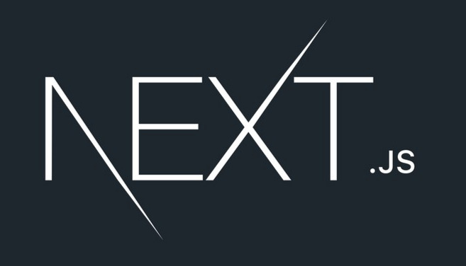
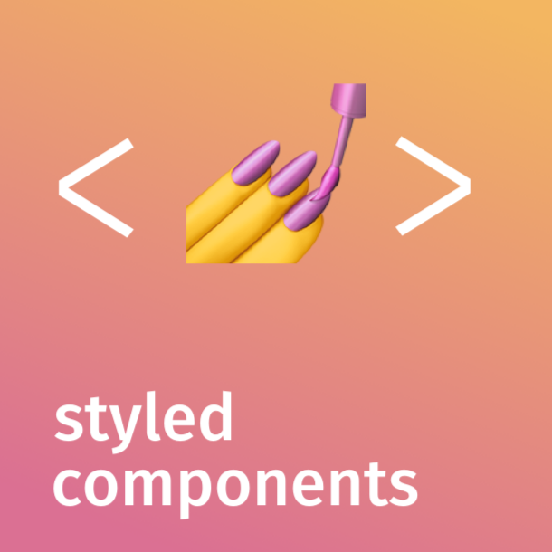

# Personal Website Frontend

This is the frontend part of my website. You can find the backend and website structure
[in the backend repo](https://github.com/monlih/personal-website-backend).

### Technologies

&nbsp;&nbsp;

&nbsp;&nbsp;

&nbsp;&nbsp;

### Deployment

My personal website is currently hosted at [`jonathanli.tech`](https://jonathanli.tech).
See [my technical blog](https://jonathanli.tech/blog), too.
